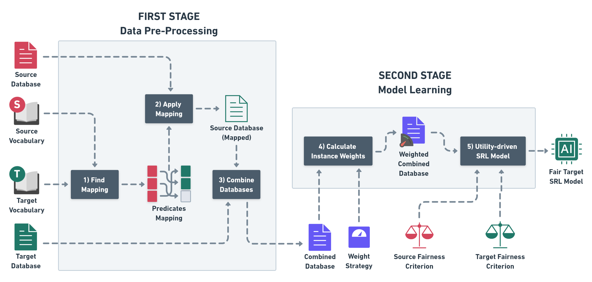

# **⚙️ UTIL-BRDN: Utility-Driven Instance-Based Transfer Learning for Relational Domains**

## **🚀 Overview**
**UTIL-BRDN** is a utility-driven, instance-based transfer learning approach designed for relational domains, focusing on statistical relational models (SRL). Unlike previous work, which address SRL transfer learning by transferring pre-trained models (model-based transfer learning), UTIL-BRDN focuses on reusing individual instances from a source domain. This allows the approach to adjust instance relevance dynamically during the learning process, providing a more flexible and robust method for transferring knowledge, especially when pre-trained models are unavailable or suboptimal for the target domain.

This implementation extends the **Boosted Relational Dependency Networks (RDN-Boost)** algorithm, incorporating a utility-based framework to ensure effective knowledge transfer and reduce negative transfer. RDN-Boost is based on the work by Natarajan, S., Khot, T., Kersting, K., Gutmann, B., & Shavlik, J. (2012) [1].



## **✨ Features**

- **Instance-Based Transfer Learning**: Reuses instances from a source domain instead of transferring a pre-trained model, which can be advantageous when the learned model does not capture relevant patterns for the target domain.

- **Utility-Driven Approach**: Uses utility functions to adjust the relevance of instances, optimizing the positive impact of knowledge transfer.

- **RDN-Boost Extension**: Builds on state-of-the-art relational learning for multi-domain scenarios, based on RDN-Boost, a powerful gradient-based boosting technique for relational data.

- **Resilient to Negative Transfer**: Robust mechanisms to minimize the impact of irrelevant or noisy instances, mitigating the risks of transferring poor-quality data.

## **⚖️ Contrast with Model-Based Approaches**
Previous transfer learning works in relational domains, such as TAMAR [2] and TreeBoostler [3], have relied on model-based transfer learning. These approaches transfer a pre-trained model from a source domain and adapt it to fit the target domain. While effective in some cases, these methods often require complex model adaptation and can be computationally expensive. Additionally, the transferred model may not retain the necessary features shared between the source and target domains, which can hinder performance.

UTIL-BRDN, in contrast, takes an instance-based approach, which offers several advantages:

- **No Need for Pre-Trained Models**: UTIL-BRDN transfers instances directly, avoiding the need for pre-trained models and their costly adaptation processes.

- **Dynamic Instance Selection**: Through a utility-driven framework, UTIL-BRDN adjusts the influence of each instance, dynamically selecting relevant data during training, which helps mitigate negative transfer.

## **📦 Installation**
> **Note:** This section is still under development and is not yet complete. Please check back later for updated instructions.

Clone the repository:

```bash
git clone https://github.com/username/util-brdn.git
```

Install the required dependencies:

```bash
pip install -r requirements.txt
```

## **⚙️ Usage**

> **Note:** This section is still under development and is not yet complete. Please check back later for updated instructions.

## **🧪 Experiments**
> **Note:** This section is still under development and is not yet complete. Please check back later for updated instructions.

UTIL-BRDN has been evaluated using a set of real-world relational datasets in the following transfer learning scenarios, including:

- Cora → IMDB
- IMDB → Cora
- IMDB → UW-CSE
- Twitter → Yeast
- Yeast → Twitter
- NELL Finances → NELL Sports
- NELL Sports → NELL Finances

The results showed significant performance improvements over learning from scratch using RDN-Boost in scenarios with limited target domain data.

## **📊 Results**
> **Note:** The paper is in the process of submission. Please check back later to get access to it.

For complete details about the experiments and results, check out the full report (*link for the paper will be available soon*).

## **🤝 Contributing**
We welcome contributions to improve UTIL-BRDN! Here are a few ways you can help:

- **Code Refactoring:** Help reorganize the codebase of this repository, as well as its dependencies, such as our modified version of [BoostSRL](https://github.com/cainafigueiredo/UtilityMultiDomainRDNBoost) and [srlearn](https://github.com/cainafigueiredo/srlearn/tree/instanceLevelUtility). The srlearn repository, in particular, needs to be packaged properly to ensure smooth installation and usage.

- **Documentation Enhancements:** Contributions that improve the clarity, comprehensiveness, and structure of the documentation are greatly appreciated. This includes code comments, user guides, and examples.

- **Future Work:** There are many exciting directions to explore in future developments, as mentioned in the research paper:

    - Adapting UTIL-BRDN to other Statistical Relational Learning (SRL) models like Markov Logic Networks (MLNs).

    - Implementing heuristic search algorithms for better mapping selection between source and target domains.

    - Exploring alternative instance weighting strategies to further mitigate negative transfer and handle instance imbalance.

Feel free to open issues or submit pull requests with your ideas!

## **📚 References**

- *[[1] Natarajan, S., Khot, T., Kersting, K., Gutmann, B., & Shavlik, J. (2012). Gradient-based boosting for statistical relational learning: The relational dependency network case. Machine Learning, 86, 25-56.](https://link.springer.com/content/pdf/10.1007/s10994-011-5244-9.pdf)*

- *[[2] Mihalkova, L., Huynh, T., & Mooney, R. J. (2007, July). Mapping and revising markov logic networks for transfer learning. In Aaai (Vol. 7, pp. 608-614).](https://cdn.aaai.org/AAAI/2007/AAAI07-096.pdf)* 

- *[[3] Azevedo Santos, R., Paes, A., & Zaverucha, G. (2020). Transfer learning by mapping and revising boosted relational dependency networks. Machine Learning, 109, 1435-1463.](https://link.springer.com/content/pdf/10.1007/s10994-020-05871-x.pdf)* 

📜 License
> **Note:** This section is still under development and is not yet complete. Please check back later for updated instructions.

🙏 Acknowledgements
> **Note:** This section is still under development and is not yet complete. Please check back later for updated instructions.